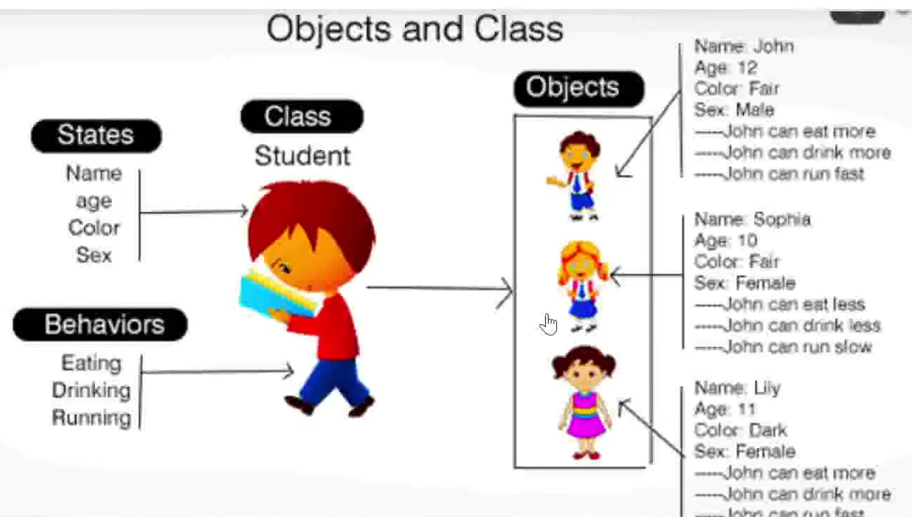
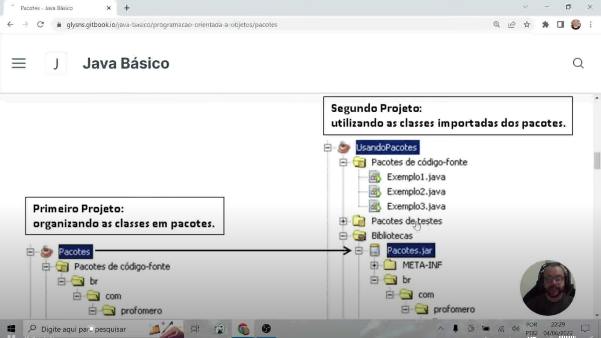
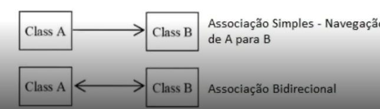
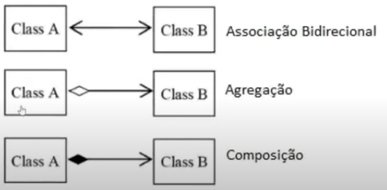
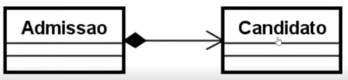
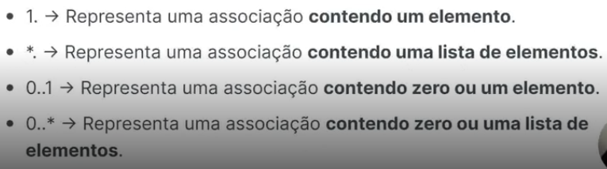
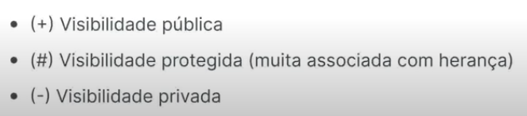
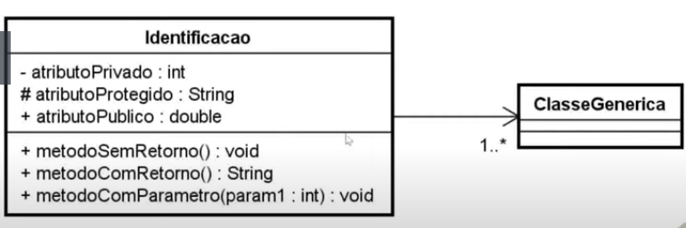
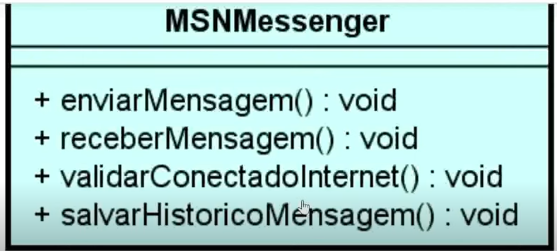

Trilha Java Básico - DIO

# Orientação a objetos

## Objetivos do curso
Abordar os conceitos do paradigma e os pilares da orientação a objetos, classes, enums, construtores, Java Bens e UML

## Assuntos
* Conceito POO
* Pacotes e Visibilidade de recursos
* Classes e Construtores
* Java Beans e UML
* Pilares do POO
* Enums e Interfaces


## Conceito POO
POO é um paradigma de programação baseado no conceito de **"Objetos"**, que podem conter dados na forma de campos, também conhecidos como atributos, e código, na forma de procedimentos, também conhecidos como métodos.

Enquanto a programação estruturada é voltada a procedimentos e funções definidas pelo usuário, a programação orientada a objetos é voltada a conceitos como o de classes e objetos.

## Classes
Toda a estrutura de código na linguagem Java é distribuído em arquivos com extensão **.java** denominados de **classe**.

As classes existentes em nosso projeto serão composta por: **Identificador, Características e Comportamentos.

* **Classe**(class): A estrutura e ou represetnação que direciona a criação dos objetos de mesmo tipo.

* **Identificador** (identity): Propósio existencial aos objetos que serão criados.

* **Características** (states): Também conhecidos como **atributos** ou **propriedades**, é toda informação que representa o estado do objeto.

* **Comportamentos** (behavior): Também conhecido como **ações** ou **métodos**, é toda parte comportamental que um objeto dispõe.

* **Instanciar** (new): É o ato de criar um objeto a partir de uma estrutura definida em uma classe. 

### CLASSES E OBJETOS


#### Criando uma Classe Student
```Java
//Criando  classe Student
//Com todas as caraterísticas e comportamentos aplicados

public class Student {
    String name;
    int age;
    Color color;
    Sex sex;

    void eating(Food food) {
        //Código aqui
    }

    void drinking(Eat eat) {
        //Código aqui
    }

    void running() {
        //Código aqui
    }
}
```
#### Criando Objetos da classe Student


```Java
public class School {
    public static void main(String [] args) throws Exception {
        Student estudante1 = new Studen();
        estudante1.name = "John";
        estudante1.age = 12;
        estudante1.color = Color.FAIR;
        estudante1.sex = Sex.MALE;

        Student estudante2 = new Studen();
        estudante2.name = "Sophia";
        estudante2.age = 10;
        estudante2.color = Color.DARK;
        estudante2.sex = Sex.FEMALE
    }
}
```

## IMPORTANTE
No exemplo acima, a classe Student **NÃO** foi estruturada com o padrão **Java Beans** com **getters e setters**.

Seguindo algumas convenções, as nossas classes são classificadas como:
* **Classe de modelo(model)**: Classes que representem estrutura de domínio da aplicação, exemplo: Cliente, Pedido, Nota Fiscal e etc.

* **Classe de serviço(service)**: Classes que contém regras de negócio e validação de nosso sistema.

* **Classe de repositório(repository)**: Classes que contém uma integração com banco de dados. 

* **Classe de controle(controller)**: Classes que possuem a finalidade de disponibilizar alguma comunicação externa à nossa aplicação, tipo **http web ou webservices**.

* **Classe Utilitária(util)**: Classe que contém recursos comuns à toda nossa aplicação.

## PACOTES

A linguagem Java é composta por milhares de classes com as finalidades de por exemplo:
* Classes de tipos de dados,
* Representação de texto, 
* Números,
* Datas, 
* Arquivos e diretórios,
* COnexão a banco de dados

Imagina todas essas classes existirem em um único nível de documento? E as outras desenvolvidas por nós, meros, desenvolvedores de aplicações de vários gêneros. Como ficaria este diretório?

Para prevenir essa bagunça, a linguagem dispõe de um recurso que organiza as classes padrão e criadas por nós, que conhecemos como pacote **(package)**. Os pacotes são subdiretórios a partir da pasta **src** do nosso projeto onde estão localizadas as classes da linguagem e novas que forem criadas para o projeto. Existem algumas convenções para criação de pacotes já utilizados no mercado.



### Nomenclatura
Pegando por base uma empresa chamada **Power Soft** e ela está desenvolvendo softwares comerciais, governamentais e um software livre ou de código aberto. Abaixo teríamos os pacotes sugeridos conforme a tabela abaixo:

* **Comercial**: com.powersoft
* **Governamental**: gov.powersoft
* **Código aberto**: org.powersoft

A organização pode ficar ainda melhor, organizando as nossas classes mediante a proposta de sua existência:
* **model**: Classes que representam a camada e modelo da aplicação: Cliente, Pedido, NotaFiscal, Usuário

* **Repository**: Classes ou interfaces que possuem a finalidade de interagir com tabelas no banco de dados: ClienteRepository

* **Service**: Classes que contém regras de negócio do sistema: ClienteService possui o método validar o CPF do cliente cadastrado

* **Controller**: Classes que possuem a finalidade de disponibilizar os nossos recursos da aplicação para outras aplicações via padrão HTTP.

* **View**: Classes que possuem alguma interação com a interface gráfica acessada pelo usuário.

* **Util**: Pacote que contém classes utilitárias do sistema: FormatadorNumeroUtil, ValidadorUtil.


### Identificação

Uma das caracteristicas de uma classe é a sua identificação, Cliente, NotaFiscal. Porém quando esta classe é organizada por pacotes, ela passa a ter duas identificações. O nome simples(nome da classe) e também o nome qualificado(endereçamento do pacote + nome)
Exemplo:

**com.controle.acesso.model.Usuario**

### Package versus import
A localização de uma classe é definida pela palavra reservada **package**, logo, uma classe só contém uma definição de package no arquivo, sempre na primeira linha do código. Para a utilização de uma classe existente em outros pacotes, necessitamos realizar a importação das mesmas, seguindo a recomendação abaixo:

```java
1. package
2.
3. import ...
4. import ... 
5.
6. public class MinhaClasse {

}

```

## VISIBILIDADE DOS RECURSOS

### MODIFICADORES DE ACESSO
Em java, utilizamos três palavras reservadas e um conceito default(sem nenhuma palavra reservada) para definir os quatros tipos de visibilidade de atributos, métodos e até mesmo classes no que se refere ao acesso por outras classes. Para uma melhor ilustração, serão representados os conceitos de visibilidade de recursos através do contexto de uma lanchonete que vende lanche natural e suco.

### Modificador Public
Como o próprio nome representa, quando nossa classe, método e atributo é definido como public, qualquer outra classe em qualquer outro pacote pode visualizar tais recursos.

### Modificador Default
Está fortemente associado a organização das classes por pacotes, algumas implementações não precisam estar disponíveis por todo o projeto, e este modificador de acesso restringe a visibilidade por pacotes.

Dentro do pacote lanchonete, iremos criar dois sub-pacotes para representar a divisão do estabelecimento.

* **lanchonete.atendimento.cozinha**: Pacote que contém classes da parte da cozinha da lanchonete e atendimentos.

* **lanchonete.area.cliente**: Pacote que contém classes relacionadas ao espaço do cliente.

### Reflexão sobre visibilidade ou modificadores de acesso.
Conhecendo as ações disponíveis nas classes Cozinheiro, Almoxarife, Atendente e Cliente, mesmo com a organização da visibilidade por pacote, será se realmente estas classes precisam ser tão explicitas?

* Será se o cozinheiro precisa saber que/como o Almoxarife controla as entradas e saídas?

* Que o Cliente precisa saber como o Atendente recebe o pedido para servir sua mesa?

* que o Atendente precisa saber que antes de pagar o Cliente consulta o saldo no App?

Dienate desses questionamento é que nossas classes precisam continuar mantendo duas ações (métodos) mas nem todas precisam ser vistas por alguém.

### Modificador Private

Depois de restruturar nosso estabelecimento(projeto) onde, temos as divisões(pacotes) espaço do cliente e atendimento, chegou a hora de uma reflexão sobre visibilidade.

## GETTERS AND SETTERS
Seguindo a convensão Java Beans

Os métodos **"Getters"** e **"Setters"** são utilizado para buscar valores de atributos ou definir novos valores de atributos de instância de classes.

O método **Getter** retorna o valor do atributo especificado.

O método **Setter** define outro novo valor para o atributo especificado.

Vemos o código abaixo da criação de um objeto Aluno com nome e idade.

### Classe Aluno

```java
public class Aluno {
    private String nome;
    private String idade;
    private String endereco;
}
```
### Classe Escola
```java
public class Escola {
    public static void main(String[] args) {
        Aluno felipe = new Aluno();
        felipe.nome = "Felile";
        felipe.idade = 23;
    }
}
```

Seguindo a convenção Java Beans, uma classe contém uma estrutura que deverá seguir as seguintes regras

* Os atributos precisam ter o modificador de acesso definido como **private**.

* Os atributos estarão visíveis apenas a nível de classe, cria-se os métodos get e set.

### Método Get()
Responsável por obter o valor atual do atributo, logo ele precisa ter o modificador **public** e retornar o tipo correspôndente ao valor.
```java
    public String getNome() {
        return nome;
    }

```

### Método set()
Responsável por definir ou modificar o valor de um atributo em um objeto, logo também precisa ter o modificador **public**, receber parâmetro do mesmo tipo da variável, mas não retorna nenhum valor.

```java
    public void setNome(String nome) {
        this.nome = nome;
    }

```
## Construtores

O método construtor é um método que não tem retorno, deve ter o mesmo nome da classe a que pertence e com parâmetros daquela classe.

```java
public class Pessoa {
    private String nome;
    private int idade;
    private double altura;


    public Pessoa(nome, idade,altura) {
        this.nome = nome;
        this.idade = idade;
        this. altura = altura;
    }
}
```

## ENUMS
Enum é um tipo especial de classe onde os objetos são previamente criados, imutáveis e disponíveis por toda aplicação.

Usado quando o modelo de negócio contém objetos de mesmo contexto que já existem de pre-estabelecida com a certeza de não haver tantas alterações de valores.

### Exemplos:
**Grau de escolaridade**: analfabeto, fundamental, médio e superior.
**Estado Civil**: Solteiro, Casado, Divorciado, Viúvo.
**Estados Brasileiros**: Ceará, São Paulo, Bahia.

Enquanto uma constante é uma variável de tipo com valor imutável, um ENUM é um conjunto de objetos já pré-definidos na aplicação.

Sendo um conjunto de objetos, Em um enum pode conter vários atributos e métodos.

### Enum EstadosBrasileiros
```java
public enum EstadosBrasileiros {
    CEARA ("CE", "Fortaleza"),
    SAO_PAULO ("SP", "sao_Paulo"),
    BAHIA ("BA", "Salvador"),
    GOIAIS ("GO", "???");

    private String nome;
    private String sigla;

    private EstadosBrasileiros(String sigla, String nome) {
        this.sigla = sigla;
        this.nome = nome;
    }

    public String getNome() {
        return nome;
    }

    public String getSigla() {
        return sigla;
    }

    public String getNomeUpper() {
        return nome.toUpperCase(); 
    }


}
```

### Classe SistemaIBGE

```java
public class SistemaIBGE {
    public static void main(String [] args) {
        for(EstadosBrasileiros est: EstadosBrasileiros.values()) {
            System.out.println(est.getSigla() + " -" + est.getNome);
        }
    }
}
```

## UML - LINGUAGEM DE MODELAGEM UNIFICADA

É uma notação que possibilita a representação gráfica do projeto.

Na UML existem três conceitos necessários para compreendermos inicialmente
* Diagramas
* Elementos
* Relacionamentos.

As notações UML são distribuidas em duas categorias de diagramas, a estrutural e comportamental conforme listagem:

### Diagramas estruturais
* Diagrama de classe: É utilizado para fazer a representação de estruturas de classes de negócio, interfaces e outros componentes do sistema. Por esta característica, este diagrama é considerado o mais importante para a UML, pois auxilia a maioria dos demais diagramas.

* Diagrama de objetos: Representa os objetos existentes em um determinaod instante ou fato na aplicação. Assom conseguimos ter uma perspectiva do estado de nossos objetos mediante a interação dos usuários no sistema.

### Diagrama de classe
Ilustra graficamente como classes serão estruturadas interligadas entre si diante da proposta do software.

É constituida por:
* Identificação: Nome ou finalidade da classe.
* Atributos: Propriedade e/ou características
* Operações: Ações e/ou métodos.

Relacionamentos
Em um diagrama as classes podem existir de forma independente, mas obviamente haverá em algumas etapas da aplicação a necessidade de algumas se relacionarem, o que devemos compreender é o nível de dependência entre elas:

Associação
Uma associação define um relacionamento entre duas classes, permitindo que um objeto tenha acesso a estrutura de um outro objeto.






* Agregação: Em uma agregação a classe principal contém uma relação com outra classe, mas ela pode existir sem a classe agregadora. Imagina em um cadastro de Candidatos, podemos encontrar candidatos que ainda não possuam uma profissão.


* Composição: A composição já caracteriza uma dependência existencial entre a classe principal e a classe associada. Imaginamos que uma admissão só poderá existir contendo  suas informações básicas e a composição do Candidato selecionado.



### Multiplicidade

Nem sempre o relacionamento entre as classes será **um para um**, um determinado cenário poderá exigir multiplicidades específicas conform opções abaixo:



### Visibilidade

Os atributos e métodos de uma classe podem receber níveis de visibilidade, Na UML existem símbolos que representam cada um deles.




### REPRESENTAÇÃO




## PILARES DA PROGRAMAÇÃO ORIENTADA A OBJETOS

Programação orientead a objetos (POO, ou OOP em inglês) é um paradigma de programação baseado no conceito de "objetos", que podem conter dados na forma de campos, també conhecidos como métodos.

Como se trata de um contexto análog ao mundo real, tudo no qual nos referimos são objetos.

A programaçao oritentada a objetos é bem requisitada no contexto das aplicações mais atuais no mercado devido a possibilidade de reutilização de código e a capacidade de representaçao do sistema ser muito mais próximo do mundo real.

Para uma linguagem ser considerada orientada a objetos, esta deve seguir o que denominamos como **Os quatros pilares da orientação a objetos**:

* **Encapsulamento**: Nem tudo precisa estar visível, grande parte do algoritmo pode ser distribuído em métodos com finalidades específicas que complementa uma ação em nossa aplicação.

* **Herança**: Características e compostamentos comuns podem ser elevados e compartilhados através de uma hierarquia de objetos.

* **Abstração**: É a indisponibilidade para determinar a lógica de um ou vários comportamentos em um objeto.

* **Polimorfismo**: São as inúmeras maneiras de se realizar uma mesma ação.


### Prática
Para ilustrar a proposta dos **Princípios de POO** no nosso cotidiano, vamos simular algumas funcionalidades dos aplicativos de mensagens instantâneas pela internet.

* MSN Messenger.
Descrever uma UML e depois em código algumas das principais funcionalidades de qualquer serviço de comunicação pela internet, inicialmente pelo MSN e depois inserindo os demais, considerando os princípios de POO.



### Pontos de atenção

* Todos os métodos da classe são public (Tudo realmente precisa estar visível?).
* Só existe uma única forma de se comunicar via internet (Como ter novas formas de se comunicar mantendo a proposta central?)

## ENCAPSULAMENTO

