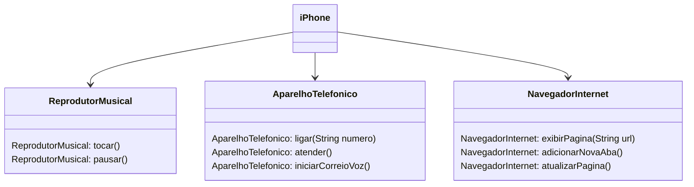

```mermaid
classDiagram
    class ReprodutorMusical {
        ReprodutorMusical: tocar()
        ReprodutorMusical: pausar()
    }

    class AparelhoTelefonico {
        AparelhoTelefonico: ligar(String numero)
        AparelhoTelefonico: atender()
        AparelhoTelefonico: iniciarCorreioVoz()
    }

    class NavegadorInternet {
        NavegadorInternet: exibirPagina(String url)
    NavegadorInternet: adicionarNovaAba()
    NavegadorInternet: atualizarPagina()
    }

    class iPhone {
    }

    iPhone --> ReprodutorMusical
    iPhone --> AparelhoTelefonico
    iPhone --> NavegadorInternet
```
