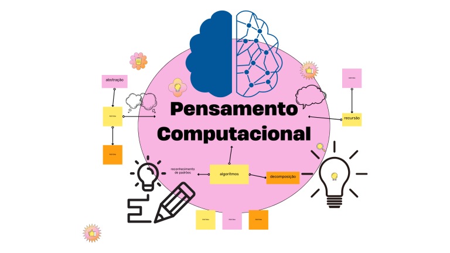

# Lógica de Programação e Pensamento Computacional

Lógica de programação é como aprender um novo idioma, um que permite **Transformar problemas em soluções claras e ordenadas através de passos lógicos e algoritmos**.

Já o pensamento computacional é como ter um mapa que te ajuda a **encontrar caminhos para resolver desafios, projetar sistemas e compreender comportamentos**.

É como ganhar superpoderes para desvendar o mundo digiral ao seu redor!

## Por Que Aprender Assim?

### Transformação Digital
A programação se tornou mais do que uma habilidade, é uma linguagem do futuro!
Dominar essa competência pode promover oportunidades incríveis!

1. **Aprendizagem Ativa**: Porque a melhor forma de aprender é fazendo. É mais do que teoria; é se preparar para o mundo real, para as demandase desafios do futuro.

2. **Comunidade Protagonista**: Aqui, aprendemos juntos, interagindo, colaborando e compartilhando conhecimento. Seja protagonista na comunidade tech mais vibrante do mundo!

## A linguagem é só um Detalhe

A linguagem de programação é apenas uma ferramenta que utilizamos programar algo que já aplicamos o pensamento computacional, já fizemos a abstração e temos a solução. Transcrever a lógica de programação que já organizamos!

## Entendendo o Desafio
Faça um programa que calcule e imprima o salário a ser transferido para um funcionário. 

Para realizar o cálculo, receba o valor bruto do salario e o adicional de benefícios.

O salário a ser transferido é calculado da seguinte maneira:

**(valor do salario bruto - percentual de imposto mediante ao salario) + adicional de benefícios**.

Para calcular o percentual de impostos segue abaixo as aliquotas:

|Faixa salarial|Porcentagem de imposto|
|----|-----|
|De R$ 0,00 a R$ 1100,00| **5%**|
|De R$ 1100,00 a R$ 2500,00|**10%**|
|Acima de R$ 2500,00|**15%**|

### ENTRADA
A entrada consiste em vários arquivos de teste, que conterá o **valor bruto do salário** e **adicional dos benefícios**. Conforme mostrado no exemplo de entrada a seguir.

